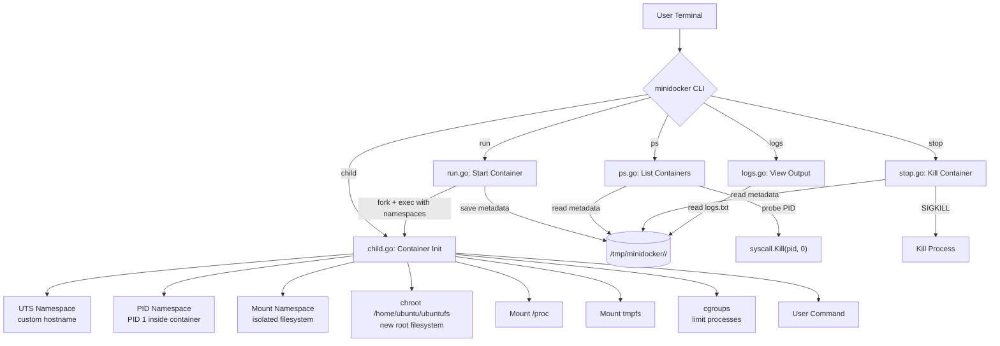
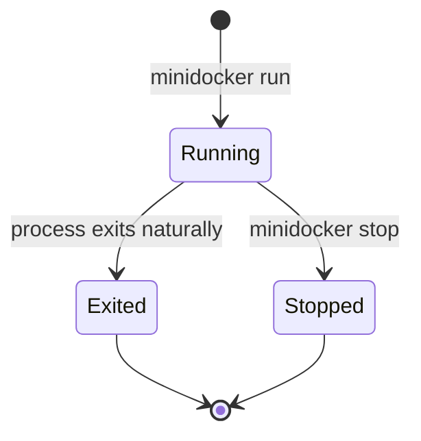

# MiniDocker (Container2Go)

A minimal container runtime written in Go that demonstrates Linux containerization concepts with full lifecycle management. Built for educational purposes to understand how tools like Docker work under the hood.

## Architecture



## Features

- **Process isolation** using Linux namespaces (UTS, PID, Mount)
- **Filesystem isolation** via chroot to a dedicated root filesystem
- **Resource limiting** with cgroups (PID count limit)
- **Virtual filesystem mounts**: `/proc` and tmpfs inside containers
- **Container lifecycle management**: run, ps, stop, logs
- **Metadata persistence** in JSON format
- **Background execution** — containers run detached
- **Log capture** — stdout/stderr saved to file
- **PID tracking** — live process monitoring

## Project Structure

```
Container2Go/
├── main.go        # CLI entrypoint — routes commands
├── run.go         # run command — spawns container in background
├── child.go       # child process — sets up namespaces, chroot, mounts
├── ps.go          # ps command — lists containers with live status
├── stop.go        # stop command — kills container by ID
├── logs.go        # logs command — prints captured output
├── container.go   # Container struct + metadata helpers (JSON)
├── cgroup.go      # cgroup setup for resource limiting
├── utils.go       # Utility functions (must, generateID)
├── go.mod         # Go module definition
├── README.md      # This file
└── LICENSE
```

## Requirements

### Linux Requirements

This runtime uses Linux-specific features and **must run on Linux**:

| Feature | Kernel Requirement |
|---|---|
| PID namespaces | `CONFIG_PID_NS` |
| UTS namespaces | `CONFIG_UTS_NS` |
| Mount namespaces | `CONFIG_NAMESPACES` |
| cgroups v1 | `/sys/fs/cgroup/pids/` must exist |
| chroot | Standard syscall |
| proc filesystem | Standard Linux |

### Root Privileges

**Root access is required** (`sudo`) because:

1. **Creating namespaces** — `CLONE_NEWUTS`, `CLONE_NEWPID`, `CLONE_NEWNS` require `CAP_SYS_ADMIN`
2. **chroot** — Only root can change the root directory
3. **Mounting filesystems** — Mounting `/proc` and `tmpfs` requires root
4. **cgroups** — Writing to `/sys/fs/cgroup/` requires root
5. **Killing processes** — `SIGKILL` to container processes requires appropriate privileges

### Root Filesystem

You need an Ubuntu (or similar) root filesystem at `/home/ubuntu/ubuntufs`. Create one with:

```sh
# Using debootstrap:
sudo debootstrap focal /home/ubuntu/ubuntufs http://archive.ubuntu.com/ubuntu

# Or download a pre-built rootfs:
mkdir -p /home/ubuntu/ubuntufs
curl -L https://cdimage.ubuntu.com/ubuntu-base/releases/20.04/release/ubuntu-base-20.04.1-base-amd64.tar.gz | sudo tar xz -C /home/ubuntu/ubuntufs
```

### Software Requirements

- Go 1.21+ (for building)
- Linux kernel 3.8+ (for namespace support)

## Build Instructions

```sh
# Clone the repository
git clone <repo-url>
cd Container2Go

# Build the binary
go build -o minidocker .

# The binary must be run on Linux with root privileges
sudo ./minidocker <command>
```

## Usage

### Run a Container

Start a new container running a command:

```sh
sudo ./minidocker run /bin/sh
sudo ./minidocker run /bin/bash
sudo ./minidocker run /bin/ls -la
```

Output:
```
Starting container a1b2c3d4
Container a1b2c3d4 started (PID: 12345)
```

The container runs in the background. Output is captured to a log file.

### List Containers

View all containers and their status:

```sh
sudo ./minidocker ps
```

Output:
```
ID          PID     STATUS     COMMAND
a1b2c3d4    12345   running    /bin/sh
e5f6a7b8    12400   exited     /bin/ls -la
```

### Stop a Container

Terminate a running container:

```sh
sudo ./minidocker stop a1b2c3d4
```

Output:
```
Container a1b2c3d4 stopped.
```

### View Logs

Print captured stdout/stderr from a container:

```sh
sudo ./minidocker logs a1b2c3d4
```

## How It Works

### Container Lifecycle



1. **`run`** — generates a unique ID, creates metadata dir at `/tmp/minidocker/<id>/`, opens `logs.txt`, re-executes the binary with `child` in new namespaces via `cmd.Start()` (non-blocking), saves PID + metadata to `config.json`
2. **Container runs** — the `child` process sets up hostname, chroot, mounts, cgroups, then executes the user's command
3. **`ps`** — reads all `config.json` files, probes each PID to check liveness
4. **`stop`** — sends `SIGKILL` to the container PID, updates status
5. **`logs`** — reads and prints the `logs.txt` file

### PID Tracking

The runtime tracks container processes using their host PIDs:

1. When `run` calls `cmd.Start()`, Go records the child process PID
2. This PID is saved to `config.json` in the container's metadata directory
3. The `ps` command checks if each PID is alive using `syscall.Kill(pid, 0)`:
   - **Signal 0** is a special signal that doesn't actually send anything — it just checks if the process exists and we have permission to signal it
   - If `Kill` returns `nil`, the process is alive → status stays `"running"`
   - If `Kill` returns an error, the process is dead → status updates to `"exited"`
4. The `stop` command uses `syscall.Kill(pid, SIGKILL)` to forcefully terminate the process

### How `ps` Works (Step by Step)

1. Read all subdirectories from `/tmp/minidocker/`
2. For each directory, load `config.json` into a `Container` struct
3. For each container with `status == "running"`:
   - Call `syscall.Kill(pid, 0)` to probe the process
   - If error → process is dead, update status to `"exited"`, save metadata
4. Format and print a table using Go's `tabwriter` for aligned columns

### How `stop` Works (Step by Step)

1. Parse the container ID from command-line arguments
2. Load the container's `config.json` metadata
3. Check if status is already `"stopped"` or `"exited"` → inform user and return
4. Call `syscall.Kill(pid, syscall.SIGKILL)` to terminate the process
   - `SIGKILL` (signal 9) cannot be caught, blocked, or ignored
   - This guarantees the process will be terminated
5. Update the container's status to `"stopped"` in `config.json`
6. Save the updated metadata

### Logging System

Container output is captured by redirecting stdout and stderr:

1. When `run` creates the child process, it opens `/tmp/minidocker/<id>/logs.txt`
2. Instead of connecting the child's stdout/stderr to the terminal, they are connected to this log file: `cmd.Stdout = logFile` and `cmd.Stderr = logFile`
3. Everything the container prints (including setup messages from `child()`) is written to the log file
4. The `logs` command simply reads this file with `os.ReadFile()` and prints it
5. The log file persists even after the container exits, so you can always review output

### Metadata Storage

Each container stores its state in `/tmp/minidocker/<container-id>/`:

```
/tmp/minidocker/a1b2c3d4/
├── config.json    # Container metadata (ID, PID, command, status, log path)
└── logs.txt       # Captured stdout/stderr output
```

Example `config.json`:
```json
{
  "id": "a1b2c3d4",
  "pid": 12345,
  "command": "/bin/sh",
  "status": "running",
  "log_file": "/tmp/minidocker/a1b2c3d4/logs.txt"
}
```

### Namespace Isolation

The runtime creates three Linux namespaces for each container:

| Flag | Namespace | Effect |
|---|---|---|
| `CLONE_NEWUTS` | UTS | Container gets its own hostname ("container") |
| `CLONE_NEWPID` | PID | Container sees its own PID 1 (init process) |
| `CLONE_NEWNS` | Mount | Mount/unmount operations are invisible to host |

The `Unshareflags: CLONE_NEWNS` ensures mount event propagation is disabled, so mounting `/proc` inside the container doesn't affect the host.

## Future Improvements

### Detached Containers
Currently the parent process exits after starting a container. A daemon architecture (like Docker's `dockerd`) could manage long-running containers, handle restarts, and provide a persistent API.

### Exec Support
Add `minidocker exec <id> <command>` to run additional commands inside a running container by entering its existing namespaces using `setns()`.

### Networking
Add network namespaces (`CLONE_NEWNET`) with virtual ethernet pairs (`veth`) to give containers their own network stack with configurable port forwarding.

### OverlayFS
Replace chroot with OverlayFS to support layered filesystems. This enables copy-on-write, shared base images, and efficient storage — the same approach Docker uses.

### Image Management
Add support for pulling and managing container images (rootfs tarballs), with commands like `minidocker pull ubuntu` and `minidocker images`.

### OCI Runtime Compatibility
Evolve toward the [OCI Runtime Specification](https://github.com/opencontainers/runtime-spec) to become compatible with container orchestrators like Kubernetes and Podman.

### Daemon Architecture
Implement a client-server model where a background daemon (`minidockerd`) manages containers, and the CLI communicates via a Unix socket or REST API.

### Resource Limits
Extend cgroup support beyond PID limits to include:
- **Memory limits** — prevent containers from exhausting host RAM
- **CPU limits** — restrict CPU time allocation
- **I/O limits** — throttle disk read/write speeds

### User Namespaces
Add `CLONE_NEWUSER` to run containers without requiring root privileges on the host, mapping container root (UID 0) to an unprivileged host user.

## Disclaimer

This project is for **educational purposes only**. It is not a secure or production-ready container runtime. Do not use it to run untrusted workloads.

## License

See [LICENSE](LICENSE) for details.
