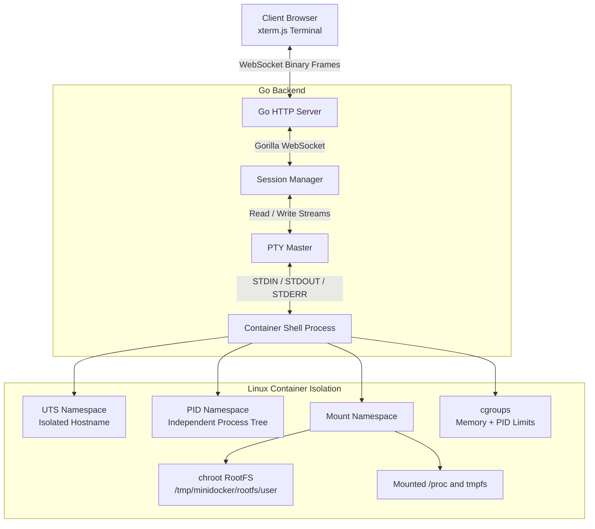

# MiniDocker — Browser-Based Container Platform

MiniDocker is an educational, end-to-end browser-based multi-user container platform written in Go. It demonstrates how modern container runtimes (like Docker) and web-based IDEs (like GitHub Codespaces or Coder) work under the hood.

Users open a web browser, log in, and are instantly dropped into their own fully isolated, persistent Linux shell running on the host system.

## High-Level Architecture



## Features

- **Multi-User**: Each authenticated user gets their own dedicated container.
- **Web Terminal**: Full interactive terminal in the browser using `xterm.js` and WebSockets.
- **PTY Support**: Interactive shell (`/bin/bash`) with job control, tab completion, and proper signal handling.
- **Persistence**: Sessions survive browser disconnects. If you close the tab and reopen it, you reconnect to the exact same shell.
- **Filesystem Isolation**: Each user gets a dedicated cloned Ubuntu rootfs via `chroot`.
- **Resource Limits**: Configured via cgroups v1 (Limits to 20 PIDs and 100MB RAM per container).
- **Process Isolation**: Linux Namespaces (UTS, PID, Mount) ensure users cannot see or interact with host processes or other containers.

## Project Structure

The project has been modernized into a clean Go architecture:

```
cmd/
├── server/main.go        # HTTP Server: Serves UI, auth, and WebSocket bridge
└── cli/main.go           # CLI Tool: Standalone container management (backward compatible)

internal/
├── runtime/              # Low-level Linux primitives
│   ├── container.go      # Metadata persistence
│   ├── child.go          # Child process init (namespaces, chroot, mounts)
│   ├── cgroup.go         # Resource limits
│   └── runtime.go        # Lifecycle manager
├── manager/
│   └── manager.go        # Orchestrates users, PTYs, and rootfs provisioning
├── websocket/
│   └── handler.go        # WebSocket <-> PTY bidirectional bridge
└── auth/
    └── auth.go           # In-memory session and user management

frontend/
├── index.html            # Login UI
├── terminal.html         # Web Terminal UI
├── style.css             # Dark theme styles
```

---

## Detailed Component Breakdown

### 1. The PTY Bridge (Pseudo-Terminal)

**Why not standard pipes?**
Standard pipes (`stdin`, `stdout`) only move raw bytes. An interactive terminal requires a PTY (Pseudo-Terminal) to provide:
- **Line Discipline**: Translating `Ctrl+C` into a `SIGINT` signal, or handling `EOF`.
- **Size Awareness**: Programs like `vim` or `htop` need to know the exact terminal dimensions (rows/cols) to render correctly.
- **Job Control**: Running processes in the background/foreground.

**How it works**:
We use `github.com/creack/pty`. When the backend starts a container, it creates a PTY master/slave pair. The slave is attached to the container's `/bin/bash` process. The Go server holds the master file descriptor. The WebSocket handler reads keystrokes from the browser and writes them to the PTY master, and reads output from the PTY master and sends it to the browser.

### 2. WebSocket Terminal Streaming

The frontend uses `xterm.js`. 
- **Input**: When a user types, `xterm.js` fires an event. The browser sends this data as a raw **Binary WebSocket Frame** to the Go server, which writes it to the PTY.
- **Output**: The Go server continuously reads from the PTY master. When data appears (e.g., the output of `ls`), it sends it as a Binary Frame back to the browser, which `xterm.js` renders.
- **Resizing**: When the browser window resizes, the frontend sends a **Text JSON Frame** (`{"type":"resize", "rows": 24, "cols": 80}`). The Go server intercepts this and sends an `ioctl` syscall (`TIOCSWINSZ`) to the PTY to update the shell's dimensions.

### 3. Container Isolation (Linux Namespaces)

When the server creates a container, it re-executes its own binary with the command `child` and passes specific clone flags:

- `CLONE_NEWUTS`: Isolates the hostname. The container sets its hostname to `container`.
- `CLONE_NEWPID`: Isolates the process ID tree. The bash shell becomes `PID 1` inside the container.
- `CLONE_NEWNS`: Isolates mounts. 
  - We `chroot` into a dedicated rootfs (`/tmp/minidocker/rootfs/<user>`).
  - We mount `/proc` so tools like `ps` work correctly, but only show containerized processes.
  - We mount a `tmpfs` at `/mytemp` for fast, ephemeral scratch space.

### 4. Resource Limiting (cgroups)

We utilize Linux control groups (cgroups) to prevent a single user from crashing the host:
- **PIDs Controller**: Capped at `20` processes. This prevents fork bombs (`:(){ :|:& };:`).
- **Memory Controller**: Capped at `100MB`. Prevents the container from consuming all host RAM.

### 5. Persistent Sessions & Manager

The `internal/manager` package maps a `username` to a specific container ID and holds the active PTY session. 
- If the WebSocket disconnects (user closes the tab), the Go server simply stops piping data. **The container and the bash process stay running in the background.**
- When the user logs back in, the manager reconnects the new WebSocket to the *existing* PTY session.

---

## Installation & Setup

### Requirements
- **Linux OS** (Ubuntu recommended). This relies on Linux-specific syscalls (Namespaces, cgroups, chroot).
- **Go 1.21+**
- **Root Privileges** (`sudo` is required to create namespaces and mounts).

### 1. Provision a Base Rootfs
You need an uncompressed Linux filesystem to act as the base for the containers. We will use `debootstrap` to download a minimal Ubuntu filesystem.

```bash
sudo apt-get update
sudo apt-get install -y debootstrap

# Download Ubuntu Focal (20.04) rootfs
sudo mkdir -p /home/ubuntu/ubuntufs
sudo debootstrap focal /home/ubuntu/ubuntufs http://archive.ubuntu.com/ubuntu
```

### 2. Build the Project

```bash
git clone <your-repo>
cd Container2Go

# Install dependencies
go mod tidy

# Build the Web Server
GOOS=linux GOARCH=amd64 go build -o minidocker-server ./cmd/server/

# Build the CLI (optional)
GOOS=linux GOARCH=amd64 go build -o minidocker-cli ./cmd/cli/
```

### 3. Run the Server

```bash
sudo ./minidocker-server
```

1. Open your browser and navigate to `http://<your-linux-vm-ip>:8080`.
2. Log in using one of the demo accounts:
   - `alice` / `password`
   - `bob` / `password`
   - `admin` / `admin`
3. You are now inside a fully functional, isolated Ubuntu container!

---

## Security Notes & Limitations

> [!CAUTION]
> **This project is educational. DO NOT expose this to the public internet without significant hardening.**

While this project utilizes namespaces and cgroups, it lacks several critical security boundaries found in production runtimes like Docker:

1. **No User Namespaces (`CLONE_NEWUSER`)**: The processes inside the container are running as `root` on the host. We use `chroot` to hide the host filesystem, but `chroot` is notoriously easy to escape if you have root privileges. Implementing user namespaces would map the container's `root` user to an unprivileged user on the host.
2. **No Capability Dropping**: The container retains all Linux capabilities (e.g., `CAP_SYS_ADMIN`). A malicious user could potentially load kernel modules or manipulate host networking. Docker drops most capabilities by default.
3. **No Seccomp Profiles**: The container can make any syscall to the host kernel.
4. **Network Isolation**: Currently, containers share the host's network stack. To isolate networking, we would need to implement `CLONE_NEWNET`, create `veth` (virtual ethernet) pairs, and attach them to a host bridge with NAT rules configured via `iptables`.

## Future Improvements

If you want to take this project further, consider implementing:

- **Network Isolation**: Implement `CLONE_NEWNET` and auto-provision `veth` interfaces for each container.
- **OverlayFS**: Currently, we use `cp -a` to copy the entire rootfs for every user. This is slow and consumes massive disk space. Using `OverlayFS` would allow all users to share a single read-only base image, writing only their modifications to a thin "upper" layer.
- **OCI Compliance**: Refactor the runtime execution to accept OCI (Open Container Initiative) standard `config.json` files, making the runtime compatible with Kubernetes or Podman.
- **MicroVMs**: For true multi-tenant security, replace Linux namespaces with hardware-virtualized MicroVMs using Firecracker (this is how AWS Lambda and Fly.io work).
