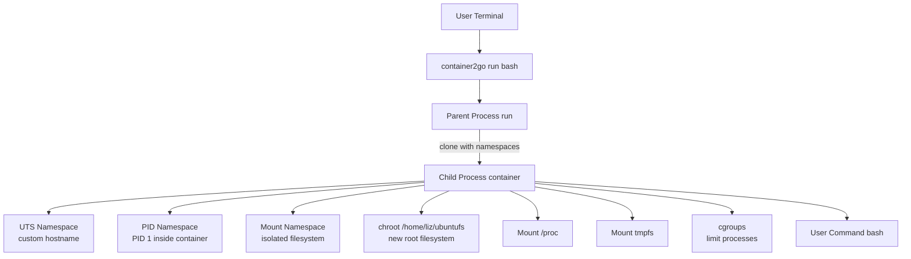

# Container2Go

Container2Go is a minimal container runtime written in Go. It demonstrates Linux namespaces, cgroups, chroot, and process isolation by running commands in a lightweight container-like environment.

## Architecture



## Features

- Process isolation using Linux namespaces (UTS, PID, mount)
- Simple cgroup setup to limit process count
- Custom hostname and root filesystem (chroot)
- Mounts /proc and a tmpfs inside the container

## Requirements

- Linux system with root privileges (for namespaces, chroot, and cgroups)
- Go 1.13+
- A root filesystem (e.g., Ubuntu rootfs) at `/home/liz/ubuntufs` (or update the path in main.go)

## Usage

Build the project:

```sh
go build -o container2go main.go
```

Run a command in a containerized environment (requires root):

```sh
sudo ./container2go run <command> [args]
# Example:
sudo ./container2go run bash
```

## How it works

1. The `run` command re-executes itself as `child` in new namespaces.
2. The `child` process sets up hostname, chroot, mounts, and cgroups, then runs the target command.
3. After the command exits, mounts are cleaned up.

## Disclaimer

This project is for educational purposes. It is not a secure or production-ready container runtime.
